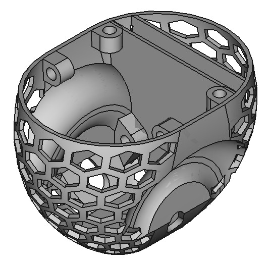
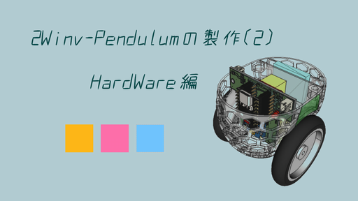

車輪型(2輪)倒立振子の製作ファイル

ここは、倒立振子のボディーCADファイル、のリポジトリとなります。

This is a repository of inverted pendulum body CAD files.

//

製作内容は、下記youtubeをご参照下さい。

Please refer to the YouTube link below for details of the production.

https://www.youtube.com/watch?v=W9z1Mw9BegU

//

Copyright (c) 2025/Apr/20, hir (hir4484@gmail.dom). Available under the MIT License. For more information, see LICENSE.